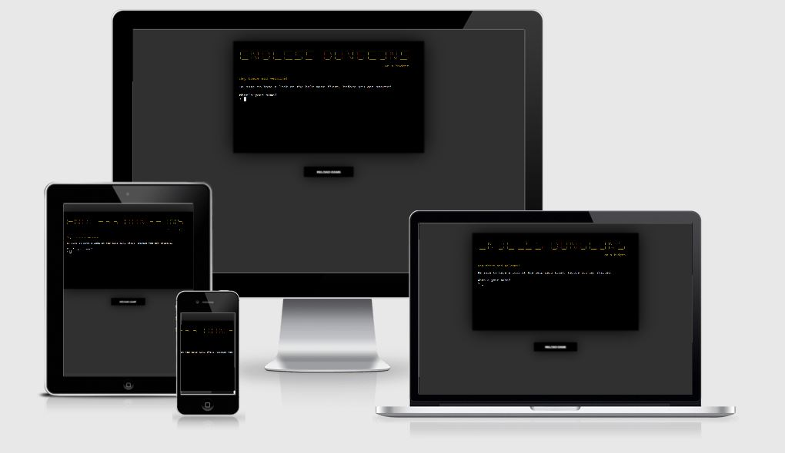

# **Portfolio Project 3 - Endless Dungeons on a Budget**
## Python Game - <a href="https://chrotesque-ci-portfolio-3.herokuapp.com/" target="_blank">View deployed site here.</a>

 

 

# Table of Contents

1. [Overview](#overview-)
2. [Logic](#logic-)
3. [Features](#features-)
4. [Technologies Used](#technologies-used-)
5. [Validation and Testing](#validation-and-testing-)
6. [Bugs](#bugs-)
7. [Deployment](#deployment-)
8. [Credits](#credits-)
9. [Acknowledgements](#acknowledgements-)

 

# **Overview** ([^](#table-of-contents))

Endless Dungeons on a budget is a Python terminal based dungeon crawler. The goal is to delve deeper and deeper while collecting loot, spending your gold with vendors and defeating enemies.

# **Logic** ([^](#table-of-contents))

# **Features** ([^](#table-of-contents))

# **Technologies Used** ([^](#table-of-contents))

# **Validation and Testing** ([^](#table-of-contents))

# **Bugs** ([^](#table-of-contents))

# **Deployment** ([^](#table-of-contents))

# **Credits** ([^](#table-of-contents))

# **Acknowledgements** ([^](#table-of-contents))
