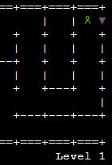
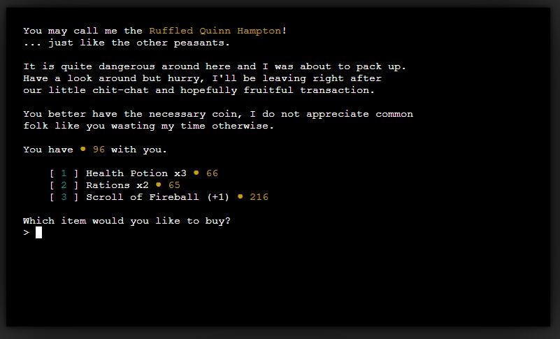
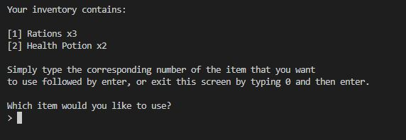

# **Portfolio Project 3 - Endless Dungeons on a Budget**
## Python Game - <a href="https://chrotesque-ci-portfolio-3.herokuapp.com/" target="_blank">View deployed site here.</a>

 

 

# Table of Contents

1. [Overview](#overview-)
2. [Logic](#logic-)
3. [Features](#features-)
4. [Technologies Used](#technologies-used-)
5. [Validation and Testing](#validation-and-testing-)
6. [Bugs](#bugs-)
7. [Deployment](#deployment-)
8. [Credits](#credits-)
9. [Acknowledgements](#acknowledgements-)

 

# **Overview** ([^](#table-of-contents))

Endless Dungeons on a budget is a Python terminal based dungeon crawler. The goal is to delve deeper and deeper while collecting loot, spending your gold on vendors and defeating enemies.

# **Logic** ([^](#table-of-contents))

I spent a good amount of time before typing any code planning and thinking through the logic of the project, as well as how to separate the logic into smaller chunks to avoid a single big python file. Given that I've never done this before, I couldn't fully anticipate the depth of this project, so the initial flow charts found an early end while I ultimately fleshed out the project as I went along.

# **Features** ([^](#table-of-contents))
- The game starts off by asking the player for a name, which - if not provided - will be provided for the player
- The player is being thrown in a randomly generated dungeon with 1 main path and several (random amount) branches leading into the main path
- The level is divided into 3 "lanes", L1 being the easiest with L3 being the hardest - enemies scale depending on what lane they're being fought on

 
- The Goal is to reach the right side and find the exit, to advance the level - which is then newly generated

 
- The player can encounter multiple drops of gold and "loot", multiple enemies as well as a single vendor per level
- The vendor allows the player to purchase a random selection of items for gold

 

- Loot can consist of healing items as well as weapons and armor, which increase the players damage and armor values or allow healing throughout the dungeon using the inventory screen

 

- The player can always check up on available commands in the help screen, it also includes additional information about the game in general

 

- As visible on the screenshots so far, various elements are color coded as it is easier on the eyes and just prettier!

# **Technologies Used** ([^](#table-of-contents))

# **Validation and Testing** ([^](#table-of-contents))

# **Bugs** ([^](#table-of-contents))

# **Deployment** ([^](#table-of-contents))

# **Credits** ([^](#table-of-contents))

# **Acknowledgements** ([^](#table-of-contents))
