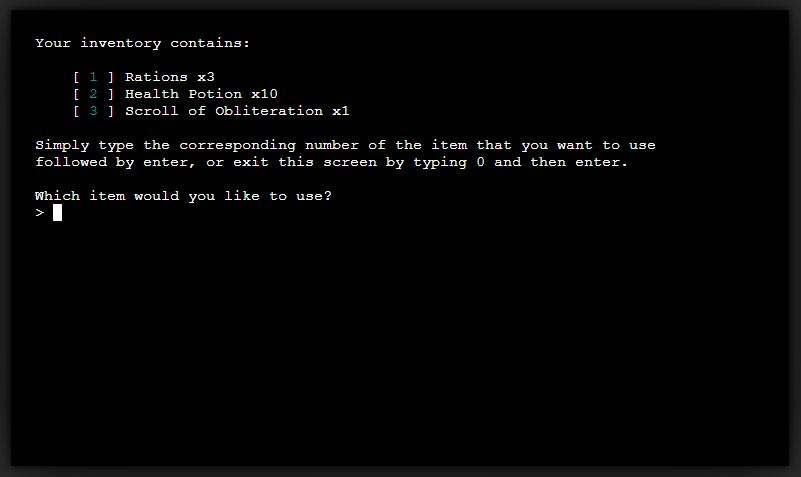

# **Portfolio Project 3 - Endless Dungeons on a Budget**
## Python Game - <a href="https://chrotesque-ci-portfolio-3.herokuapp.com/" target="_blank">View deployed site here.</a>

 

 

# Table of Contents

1. [Overview](#overview-)
2. [Logic](#logic-)
3. [Features](#features-)
4. [Technologies Used](#technologies-used-)
5. [Validation and Testing](#validation-and-testing-)
6. [Bugs](#bugs-)
7. [Deployment](#deployment-)
8. [Credits](#credits-)
9. [Acknowledgements](#acknowledgements-)

 

# **Overview** ([^](#table-of-contents))

Endless Dungeons on a budget is a Python terminal based dungeon crawler. The goal is to delve deeper and deeper while collecting loot, spending your gold on vendors and defeating enemies.

# **Logic** ([^](#table-of-contents))

I spent a good amount of time before typing any code planning and thinking through the logic of the project, as well as how to separate the logic into smaller chunks to avoid a single big python file. Given that I've never done this before, I couldn't fully anticipate the depth of this project, so the initial flow charts found an early end while I ultimately fleshed out the project as I went along.

Flowchart:

 

# **Features** ([^](#table-of-contents))
- The game starts off by asking the player for a name, which - if not provided - will be provided for the player
- The player is being thrown in a randomly generated dungeon with 1 main path and several (random amount) branches leading into the main path
- The level is divided into 3 "lanes", L1 being the easiest with L3 being the hardest - enemies scale depending on what lane they're being fought on

     
- The Goal is to reach the right side and find the exit, to advance the level - which is then newly generated

     
- The player can encounter multiple drops of gold and "loot", multiple enemies as well as a single vendor per level
- The vendor allows the player to purchase a random selection of items for gold

     

- Loot can consist of healing items as well as weapons and armor, which increase the players damage and armor values or allow healing throughout the dungeon using the inventory screen

     

- The player can always check up on available commands in the help screen, it also includes additional information about the game in general; the commands / keys were chosen based off of regular video game controls (W, A, S, D) and for convenience sake (inventory being on Q)

     
     

- All entities have their own specific colors through colorama

- Every enemy, equipment piece (weapons, armor), vendor and player names if the player does not provide a name are randomly generated from lists of possible variations and combinations

- Everything from enemy health, damage, gear strength values is randomly generated. A few things are additionally based on level to increase in strength the further the player gets and enemies are, additionally, also stronger on higher lanes (L1 > L2 > L3)

- The generation of items throughout the level follows certain rules, such as the vendor is never to be found on the main path, to encourage exploration; a few loot drops will always be on the main path, the rest will be on the side branches, etc.

- Every action in the game provides text feedback under the headline of the "Narrator":

     

     

- Upon death the player will see an overview of a few achievements, in regards to stats:

     

 

# **Technologies Used** ([^](#table-of-contents))

- Main language: <a href="https://www.python.org/" target="_blank">Python</a>

    various external modules as listed in [Credits](#credits-)

- <a href="https://git-scm.com/" target="_blank">Git</a> used for version control through the Gitpod terminal for deployment onto Github
- <a href="https://github.com/" target="_blank">GitHub</a> used as host of the site
- <a href="http://gitpod.com" target="_blank">Gitpod</a> used as IDE
- <a href="https://www.heroku.com" target="_blank">Heroku</a> used for deployment
- <a href="http://clickup.com" target="_blank">ClickUp</a> used for project management
- <a href="https://lettercounter.github.io/" target="_blank">Lettercounter</a> used to keep commit messages below or at 50 characters
- <a href="http://ami.responsivedesign.is/" target="_blank">Am I Responsive?</a> used to create responsive preview of the site used at the top of this readme
- <a href="http://pep8online.com/" target="_blank">PEP8 Online</a> used to validate the python code
- <a href="https://app.diagrams.net" target="_blank">draw.io</a> used to create a flowchart and to plan the project in the beginning

 

# **Validation and Testing** ([^](#table-of-contents))

1. <a href="http://pep8online.com/" target="_blank">PEP8 Online</a> was used to validate all python code, I made sure that it contains no errors or warnings.

2. I modified the HTML and CSS slightly to be easier on the eyes, however no extra visible elements were added. Given the non responsive nature of the template used from Code Institute, nothing has changed in that respect and no additional testing or validation was done.

3. Manual testing through Gitpod and Heroku was done extensively to ensure that all features and user inputs work flawlessly and are accounted for. 

The only problem that might arise in higher levels is scaling of various formulas, they might make it impossible to progress progressively, the player might get killed in a single hit if unlucky with gear drops.

 

# **Bugs** ([^](#table-of-contents))

1. The only bug I'm aware of after extensive testing is that the branch creation code does not remove it's own walls if it loops inside of itself. While not intentional, it does lead to a much more interesting path creation ultimately and I left it as it is.
Correcting it would have meant more straight forward paths without sharp corners and would have required more code to account for various situations where it would loop into a corner.

    With the bug it might look like:

     
     

    Without the bug, it would probably look like this:

     
     

2. Unsure if this is a bug or I am simply not understanding how os system clear works, however about 6 lines of the help menu would remain after the clear (and thus return to the game), that would stuck up the more often the help menu is being opened. 

    After many attempts to fix this, I decided to split the help menu into 2 parts to fit the screen without scrolling and deactivated scrolling. The help menu was the only thing that would require scrolling.
    This also had the positive side effect of the help menu now being in full view at first, unlike with the full version being scrolled down to the end of the content, which would result in the beginning of the help menu being not visible until the user scrolls up.

 

# **Deployment** ([^](#table-of-contents))
This project was developed using Gitpod through which it was committed and pushed to the repository on Github as host:
1. Visit <a href="https://github.com/" target="_blank">GitHub</a> and login
2. Open the <a href="https://github.com/Chrotesque/ci-portfolio-project-1" target="_blank">respository</a>

## Making a Local Clone
Once the project has been accessed on Github:
1. Underneath the repository specific navigartion you'll find the button **Code** on the right side above the file listing
2. Upon click, the pop-up will offer the option to copy the repository's git-URL with HTTPS selected at the top within the pop-up
4. Open a Git Bash terminal
5. Change the current working directory to the location where you want the cloned directory to be made
6. Type **git clone**, and then paste the URL you copied in Step 3 and hit Enter; your local clone will now be created

## Heroku
Heroku is being used to deploy this python based project. There's a few ways to go about this, this is the way I did it:
1. After <a href="https://signup.heroku.com/login" target="_blank">account creation</a>
2. Login to Heroku
3. Create a new Heroku app
4. In the app settings, set the buildbacks to "Python" and "NodeJS" in that order
5. In the same menu, add a config var with the key "PORT" and value '8000'

## Heroku CLI through Gitpod
1. Create a runtime.txt in the main directory of your project and git push it after entering:
    > python-3.8.13
2. A login through the terminal is required with the command: 
    > heroku login -i

    The heroku accounts email address will be required as well as:
        - without 2FA active: your password
        - with 2FA active:
        
            1. Heroku website > Account settings > Applications > Authorizations > Create Authorization
            2. use the newly generated Authorization token as password for the CLI login in the Gitpod terminal

3. Link your Heroku app with your Github repo and replace "your_app_name" with your apps name as seen on Heroku:
    > heroku git:remote -a your_app_name
4. Deploy the project through the following command:
    > git push heroku main

 

# **Credits** ([^](#table-of-contents))
External modules used:
- random for random number generation (https://docs.python.org/3/library/random.html)
- colorama for color various elements (https://github.com/tartley/colorama)
- math for rounding operations (https://docs.python.org/3/library/math.html)
- numpy for probabilities (https://numpy.org/)
- os for clearing the screen (https://docs.python.org/3/library/os.html)
- pyfiglet for ASCII art font (https://github.com/pwaller/pyfiglet)

All other code was written by myself.

 

# **Acknowledgements** ([^](#table-of-contents))
I'd like to thank my Mentor Jack Wachira for our in-depth sessions and helpful comments discussing this project.